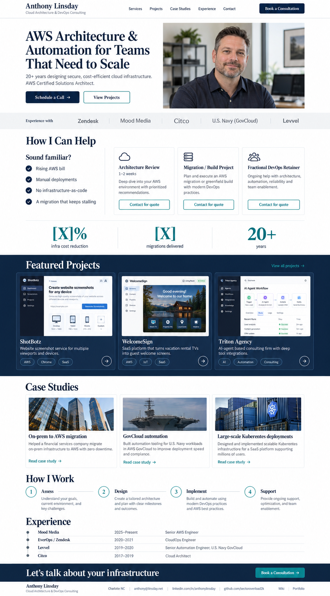

# Consultant Redesign

Redesign of anthonyl.com from the green "console" terminal theme to a professional consulting site.

## Approach

- Build a new Hugo theme at `themes/consultant/` and set `theme = "consultant"` in `config.toml`. Keep `themes/console/` untouched so it can be rolled back.
- Hugo version must match CI: **0.124.1 extended** (`.github/workflows/deploy.yml`).
- Pull content from existing data/content where it exists:
  - Experience → `data/experience.yaml`
  - Projects → `content/portfolio/*.md` (ShotBotz, WelcomeSign, Triton Agency featured)
  - Contact/social → `[params]` in `config.toml`
- New content (services, case studies, process steps, stats) goes in new data files (e.g. `data/services.yaml`, `data/casestudies.yaml`, `data/process.yaml`, `data/stats.yaml`) — not hardcoded in templates.
- Wiki (`/wiki/`), Portfolio (`/portfolio/`) and Music (`/music/`) pages must keep working with the new theme. Music is linked from footer only.
- Responsive: must work at 390px mobile width (no horizontal scroll, hamburger nav).

## Design tokens

| Token | Value |
|---|---|
| Primary (navy) | `#0B1F3A` |
| Accent (teal) | `#0F7C80` |
| Project card bg | `#12294A` |
| Background | `#FFFFFF`, light band `#F3F5F8` |
| Headings | Playfair Display or Source Serif (Google Fonts) |
| Body | Inter (Google Fonts) |

## Sections (top to bottom)

1. **Sticky nav** — name + "Cloud Architecture & DevOps Consulting"; Services, Projects, Case Studies, Experience, Contact; navy "Book a Consultation" button.
2. **Hero** — "AWS Architecture & Automation for Teams That Need to Scale"; subhead; "Schedule a Call" + "View Projects" buttons; headshot `static/images/headshot.jpg` (900x1125, real photo).
3. **Trust bar** — "Experience with" Zendesk, Mood Media, Citco, U.S. Navy (GovCloud), Levvel (text, grayscale).
4. **How I Can Help** — "Sound familiar?" checklist + 3 engagement cards (Architecture Review, Migration / Build Project, Fractional DevOps Retainer) with "Contact for quote".
5. **Stats** — values in `data/stats.yaml`. Use the owner-provided figures below: `$182K` saved in one year / `$75K+/yr` saved by one migration / `20+` years.
6. **Featured Projects** — full-width navy band, 3 dark cards with screenshot, description, tags, arrow link to the portfolio page.
7. **Case Studies** — 3 cards: On-prem to AWS migration (financial services), GovCloud automation (U.S. Navy), Large-scale Kubernetes deployments (SaaS). Each links to its own page (see below).
8. **How I Work** — Assess → Design → Implement → Support.
9. **Experience** — compact timeline from `data/experience.yaml`. Each job links to its own page (see below).
10. **CTA band** — "Let's talk about your infrastructure" + "Book a Consultation".
11. **Footer** — Charlotte NC, email, LinkedIn, GitHub, links to Wiki and Portfolio.

## Do NOT copy from the mockup

The mockup is AI-generated. Fix these instead of reproducing them:

- Typo "Kuberentes" → **Kubernetes**.
- Case-study claims "zero downtime" and "millions of users" are invented — use neutral text or ask the owner.
- Stock photos (skyscrapers, ship, containers) are placeholders. Use the real headshot, not the mockup's.
- No testimonials unless the owner provides real ones.

## Owner-provided results (real, use these)

- **$182K** in AWS cost savings for Mood Media in one year (2025).
- **$75K+/yr** ongoing savings from a migration completed at Mood Media in September 2026.

Where to use them:
- Stats row (above).
- Mood Media job page (`content/experience/mood-media.md`) — list both as outcomes.
- A new case study, e.g. "AWS cost optimization & migration — media company", with the details beyond these numbers marked `TODO`.

Do not add percentages, timelines or other numbers the owner hasn't provided.

## Calls to action

All "Book a Consultation" / "Schedule a Call" / "Contact for quote" buttons are `mailto:anthony@linsday.net` for now (use `params.email` from `config.toml`, add a sensible `?subject=`). Keep the URL in one place (e.g. `params.bookingURL`) so it can be swapped for a booking link later.

## Detail pages

Each **job** and each **case study** gets its own page.

- `content/experience/<slug>.md` — one per job in `data/experience.yaml` (Mood Media, Carolina Brew Supply, EverOps / Zendesk, Levvel, Citco). Front matter: company, role, dates, summary, tech tags. Body: responsibilities and outcomes. Section list page at `/experience/`.
- `content/case-studies/<slug>.md` — one per case study. Suggested structure: Client/industry, Challenge, Approach, Results, Tech stack. Section list page at `/case-studies/`.
- Use page bundles or front matter for card images.
- Home page cards and the timeline link to these pages.
- Pre-populate with only what is already known (the site/resume content); mark anything else `TODO` for the owner. Do not invent details, metrics or clients.

## Decisions made

- [x] Booking CTA → `mailto:` email (for now)
- [x] Headshot → `static/images/headshot.jpg`
- [x] Each job and case study gets its own page
- [x] Stats: $182K saved in a year; $75K+/yr from one migration

## Open questions for the owner

- Confirm it's OK to name Mood Media alongside the savings figures (default: name it on the job page, use "media company" on the home page/case study).
- Case-study details (challenge, approach, results).
